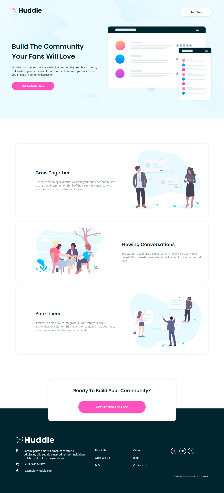
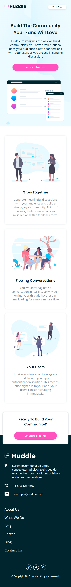

# Frontend Mentor - Huddle landing page with alternating feature blocks solution

This is a solution to the [Huddle landing page with alternating feature blocks challenge on Frontend Mentor](https://www.frontendmentor.io/challenges/huddle-landing-page-with-alternating-feature-blocks-5ca5f5981e82137ec91a5100). 

## Table of contents

- [Overview](#overview)
  - [Screenshot](#screenshot)
  - [Links](#links)
- [My process](#my-process)
  - [Built with](#built-with)
  - [Useful resources](#useful-resources)
- [Author](#author)

## Overview

### The challenge

Users should be able to:

- View the optimal layout for the site depending on their device's screen size
- See hover states for all interactive elements on the page

### Screenshot

### Links

- Solution URL: [Github repo](https://github.com/b16h22/huddle_feature_blocks_solution)
- Live Site URL: [Github pages](https://b16h22.github.io/huddle_feature_blocks_solution/)

## My process

### Built with

- Semantic HTML5 markup
- CSS custom properties
- Flexbox
- CSS Grid

### Useful resources

- [CSS Flexbox](https://www.w3schools.com/css/css3_flexbox.asp) - This is a good article that helped me understand CSS Flexbox and it's capabilities.
- [CSS Grid](https://www.w3schools.com/CSS/css_grid.asp) - This is a detailed article that helped me understand CSS Grid layout and it's possibilities.

## Author

- Frontend Mentor - [@b16h22](https://www.frontendmentor.io/profile/b16h22)